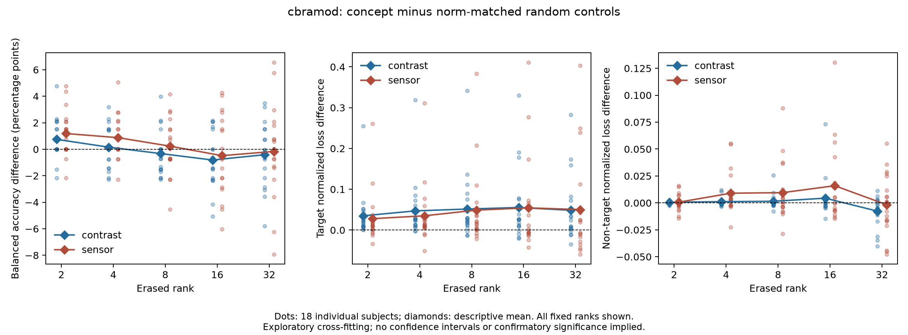
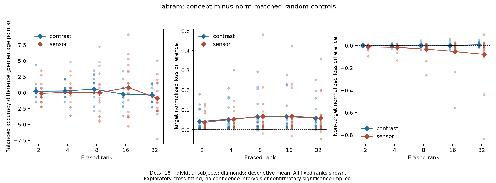
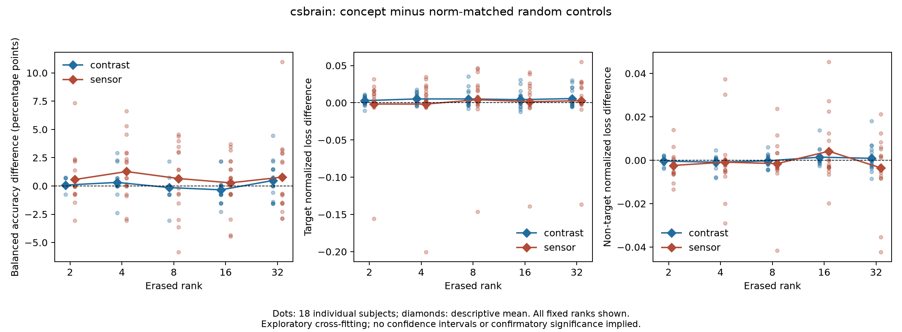

# Contrast task comparison: completed three-model results

Status: CBraMod, LaBraM and CSBrain complete (each 18 subjects, 810 trials, 71 conditions). Exploratory cross-fitting, not a new independent test.

## CBraMod

Clean mean subject balanced accuracy: 0.55045. Below are concept minus mean norm-matched random effects; accuracy is in percentage points, descriptor losses are normalized by each fold's fitting-target variance. Positive descriptor-loss differences indicate greater readout damage.

| Method | Rank | Accuracy difference (pp) | Target loss difference | Non-target loss difference | Subjects with accuracy decrease |
| --- | ---: | ---: | ---: | ---: | ---: |
| contrast | 2 | 0.745 | 0.0349 | 0.0006 | 2/18 |
| contrast | 4 | 0.158 | 0.0470 | 0.0012 | 7/18 |
| contrast | 8 | -0.325 | 0.0515 | 0.0015 | 10/18 |
| contrast | 16 | -0.813 | 0.0553 | 0.0044 | 11/18 |
| contrast | 32 | -0.412 | 0.0485 | -0.0076 | 11/18 |
| sensor | 2 | 1.187 | 0.0279 | 0.0007 | 2/18 |
| sensor | 4 | 0.876 | 0.0350 | 0.0090 | 4/18 |
| sensor | 8 | 0.236 | 0.0488 | 0.0095 | 8/18 |
| sensor | 16 | -0.482 | 0.0544 | 0.0160 | 10/18 |
| sensor | 32 | -0.163 | 0.0502 | -0.0017 | 9/18 |

Both methods show positive mean target-readout loss relative to matched random controls at every rank. However, the clean final μ/β readouts fail to generalize (see the audit below), so increased loss is not evidence of meaningful physiological information removal. Accuracy effects change sign across ranks and subjects; these results do not establish a consistent task dependence on the targeted directions. The clean task readout is itself modest, and no confirmatory significance claim is made.

At ranks 4–16 the contrast-only method has smaller mean non-target loss differences than sensor projection. This is a descriptive pattern, not proof of biological specificity: the methods have different actual perturbation norms, and each uses its own matched controls. Comparisons between methods are not automatically equal-energy comparisons. All ranks and individual effects remain available; none was selected as a confirmatory endpoint.

Across all three folds, contrast matching has 1,537/12,150 gains above two (12.65%) and 28/12,150 above ten (0.23%); maximum 162.17. Sensor matching has 698/12,150 above two (5.74%), none above ten, maximum 6.69. These counts span trials × three random seeds × five ranks and are not independent samples.

The largest gain is fold 1, subject 16, rank-two contrast control seed 31: its unscaled norm is approximately 0.000607, scaled to 0.098507. Thus a large multiplier need not imply a large absolute activation change, but it shows the matched control is far from the original projection. All cases remain included; no gain cutoff was selected after observing effects. Equal norm does not establish equal physiological plausibility. The detailed diagnostic is `results/contrast-task-cbramod-gains.json`. Fold training sets overlap; displayed means have no confirmatory confidence intervals.

Source: `research/eeglens_mi/contrast-task-v1/cbramod/summary.json`; reconstruction and verification use `summarize_contrast_task.py` and `plot_contrast_task.py`. No main-test split, probe or frozen protocol was changed.

## Clean-readout audit changes the interpretation

| Model | Clean final μ pooled R² | Clean final β pooled R² | Subjects with μ R² > 0 | Subjects with β R² > 0 |
| --- | ---: | ---: | ---: | ---: |
| CBraMod | −0.164 | −0.203 | 1/18 | 1/18 |
| LaBraM | −0.142 | −0.160 | 1/18 | 1/18 |
| CSBrain | −0.217 | −0.061 | 0/18 | 2/18 |

These are the clean **final-layer frozen readouts used to score native interventions**, not the middle-layer contrast probes in the offline recovery study. Their weak generalization means that a larger target prediction error after erasure cannot establish that a reliable physiological representation was selectively removed. It also prevents interpreting small task effects as proof that the brain feature is irrelevant. A useful negative result here is identifying the readout bottleneck and the need to audit it before assigning meaning to intervention losses. Nonlinear information or other readouts are not ruled out.

The non-target readouts also vary strongly by subject: CBraMod pooled occipital-alpha/global-RMS R² are 0.501/0.830 but only 3/18 and 8/18 subjects have positive individual R². LaBraM values are 0.250/−0.025 with 2/18 and 3/18 positive. Pooled success does not certify a generally usable control readout.

## LaBraM

Clean mean subject balanced accuracy: 0.54878. Effects below are concept minus mean norm-matched random; all fixed ranks are retained.

| Method | Rank | Accuracy difference (pp) | Target loss difference | Non-target loss difference |
| --- | ---: | ---: | ---: | ---: |
| contrast | 2 | 0.240 | 0.0412 | 0.0003 |
| contrast | 4 | 0.279 | 0.0518 | -0.0005 |
| contrast | 8 | 0.563 | 0.0647 | 0.0011 |
| contrast | 16 | -0.223 | 0.0665 | 0.0013 |
| contrast | 32 | -0.376 | 0.0582 | 0.0075 |
| sensor | 2 | -0.103 | 0.0373 | -0.0110 |
| sensor | 4 | 0.095 | 0.0528 | -0.0153 |
| sensor | 8 | 0.001 | 0.0678 | -0.0313 |
| sensor | 16 | 0.836 | 0.0674 | -0.0535 |
| sensor | 32 | -0.896 | 0.0579 | -0.0785 |

The mean accuracy differences remain within approximately ±0.9 percentage points and vary in sign across ranks. Positive target loss differences cannot overcome the failed clean-readout audit. Negative non-target loss differences for sensor erasure mean less error increase than the corresponding random controls, not proof of physiological improvement or selectivity. LaBraM pretraining includes EEGMMIDB, so downstream subject-disjoint fitting is not a pretraining-unseen evaluation.

Reproduce the clean audit with `audit_clean_readouts.py --results <model-response-root> --output <new-json>`; it requires three completed folds and retains input hashes.

## CSBrain

Clean mean subject balanced accuracy: 0.63276. All three folds pass the summary checks (18 subjects, 810 unique trials, identical provenance and 71 conditions). An additional audit confirms prepared labels/descriptors/subjects, current runner/helper/fitter/builder/protocol hashes, finite predictions/gains and all 24,300 matched-norm comparisons.

| Method | Rank | Accuracy difference (pp) | Target loss difference | Non-target loss difference | Subjects with accuracy decrease |
| --- | ---: | ---: | ---: | ---: | ---: |
| contrast | 2 | 0.079 | 0.0029 | -0.0004 | 1/18 |
| contrast | 4 | 0.314 | 0.0052 | -0.0009 | 2/18 |
| contrast | 8 | -0.144 | 0.0052 | -0.0003 | 6/18 |
| contrast | 16 | -0.341 | 0.0042 | 0.0014 | 10/18 |
| contrast | 32 | 0.482 | 0.0057 | 0.0009 | 5/18 |
| sensor | 2 | 0.569 | -0.0017 | -0.0024 | 7/18 |
| sensor | 4 | 1.274 | -0.0017 | -0.0009 | 5/18 |
| sensor | 8 | 0.659 | 0.0041 | -0.0015 | 7/18 |
| sensor | 16 | 0.278 | 0.0015 | 0.0042 | 8/18 |
| sensor | 32 | 0.779 | 0.0028 | -0.0035 | 9/18 |

CSBrain has a more usable task readout in this cohort than the other two models, but its clean physiological readouts still fail pooled generalization. Contrast intervention effects change sign across ranks. Positive sensor accuracy differences mean less damage (or more improvement) than matched random controls, not evidence that erasing physiology improves performance. Non-target pooled alpha/RMS R² are 0.320/0.866, with only 0/18 and 9/18 positive individual scores.

## Matching diagnostics across models

Each row covers 12,150 correlated trial × seed × rank entries. These thresholds are descriptive; no cases were excluded.

| Model | Method | Gains > 2 | Gains > 10 | Maximum gain |
| --- | --- | ---: | ---: | ---: |
| cbramod | contrast | 1537 | 28 | 162.17 |
| cbramod | sensor | 698 | 0 | 6.69 |
| labram | contrast | 1990 | 44 | 72.54 |
| labram | sensor | 212 | 0 | 3.93 |
| csbrain | contrast | 857 | 14 | 50.39 |
| csbrain | sensor | 176 | 0 | 4.16 |

The rare large contrast multipliers occur in all three models. Actual delta norms match their concept interventions, but equal norm does not imply equivalent physiological plausibility or equal distance from the activation distribution. The sensor and contrast methods have separate matched controls; direct between-method differences are not automatically equal-energy comparisons.

## Decision from the completed experiment

This experiment does not support proceeding to cross-model steering on the premise of a shared selective μ/β dependence. Across the fixed ranks, mean concept-minus-matched task effects are small (under 1.3 percentage points in absolute value) and subject effects are heterogeneous. This is not an equivalence test or proof of absent dependence. The central limitation is that all three frozen final physiological readouts fail pooled generalization, so their intervention losses cannot establish meaningful information removal.

Together with the recovery experiments, the evidence distinguishes three failures of interpretation: original-probe erasure can leave recoverable information; a failed final readout can miss information accessible to another pooling/readout; and matched activation norm cannot certify physiological specificity. The [final pooling diagnostic](FINAL_POOLING_DIAGNOSTIC.md) illustrates the second point for LaBraM, but remains exploratory and has not been substituted into these native results.

A next causal study needs a physiological readout that generalizes across evaluation subjects, an independently fixed evaluation cohort, and a selective native intervention validated against both recovery and collateral damage. Do not expand ranks, select subjects, or change the present readouts after seeing these outcomes to obtain a positive mechanism claim. Retain this study as a completed, reproducible analysis of the specified artifacts and an integration exercise; fresh-machine reproduction and broader platform coverage remain separate public-readiness requirements.
