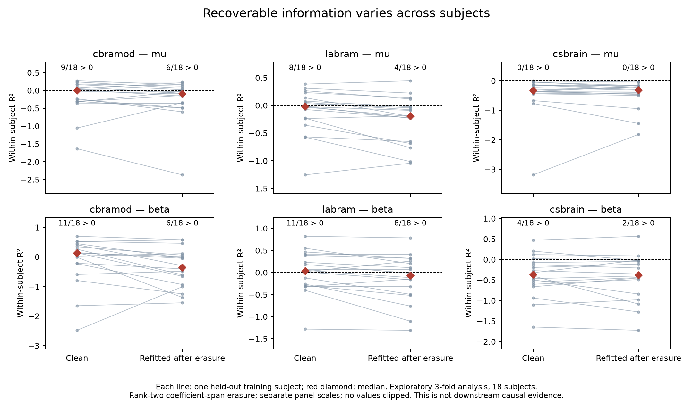

# 概念方向的泛化與資訊恢復：探索性追蹤

這個分析在看到主研究 test 結果後提出，因此是 exploratory。只讀取原始 18 位 training subjects 的 features，不讀取原 validation/test arrays，也不更新主研究 probe、干預或 protocol。

固定 seed 2041 將 18 人分成三個 outer folds，每輪六人做評估；其餘十二人再切為九人擬合、三人選 ridge 正則化。每位受試者只產生一組 out-of-fold 預測。分析對象是中間層時間平均後的 C4−C3 特徵，並非重新執行下游模型干預。

每一 fold 由擬合 probe 的 μ／β 係數張成 rank-two 子空間，移除其投影。這與 C3、C4 使用相同中心時的時間平均對比一致，因為中心在相減時抵消。固定 probe 的 feature-dependent 輸出在投影後應為零；程式逐 fold 驗證至 1e−10。接著在剩餘特徵重新擬合 probe，並以三個固定隨機 rank-two 投影做對照。隨機對照匹配 rank，未匹配能量；不能將它解讀為主研究的等強度因果對照。

## 結果

下表為全部 18 位受試者 out-of-fold trials 合併後的 R²：

| 模型 | clean μ | recovered μ | clean β | frozen-erased β | recovered β | random-erased β 範圍 |
| --- | ---: | ---: | ---: | ---: | ---: | ---: |
| CBraMod | 0.108 | 0.046 | 0.463 | −0.132 | 0.264 | 0.462–0.462 |
| LaBraM | 0.166 | 0.060 | 0.511 | −0.201 | 0.453 | 0.481–0.513 |
| CSBrain | −0.146 | −0.169 | 0.145 | −0.409 | 0.126 | 0.128–0.156 |

LaBraM 的 β recovery 在三個 outer folds 的 pooled R² 都大於零（0.212、0.511、0.498）；CBraMod 為 −0.046、0.373、0.263，CSBrain 為 −0.045、0.274、−0.105。這支持部分生理資訊存在於原係數張成空間之外，尤其 LaBraM；並不表示所有受試者都能恢復。

**合併 trials 的分數掩蓋了受試者差異：**

| 模型 | clean β：個別 R² > 0 人數 | recovered β：個別 R² > 0 人數 | recovered β：個別 R² 中位數 |
| --- | ---: | ---: | ---: |
| CBraMod | 11／18 | 6／18 | −0.350 |
| LaBraM | 11／18 | 8／18 | −0.067 |
| CSBrain | 4／18 | 2／18 | −0.377 |

個別 R² 的分母使用該受試者的 target variance；它與 pooled R² 的基準不同。受試者間的平均值與變異差異可能影響 pooled 結果，不能僅凭 pooled 分數宣稱逐受試者可用。此分析也只用九人擬合，與主研究十八人的擬合量不同，不能直接視為同一 probe 的效能重現。

## 對主研究的修正解釋

1. 原 probe 失效有代數上的必然性，不能當成「β 資訊被移除」的證據。重新擬合後仍可讀出，實際顯示此次 rank-two 方法沒有完成資訊移除。
2. CBraMod 在 training cross-fitting 的 pooled β 表現仍不差，不能宣稱這個分析已完整預測它的主 test 失敗；但 fold 與個別受試者的異質性提供了事前可檢查的警訊。
3. CSBrain 的 μ 在每位受試者皆沒有正 R²，β 也只有少數受試者能讀出。用此概念定義歸因其 task 損傷，證據不足。

後續應先驗證生理方向在 subject-wise 評估下是否穩定，再評估更充分的資訊移除。可探索迭代線性移除與重新擬合，但必須追蹤維度、擾動強度、非目標資訊與任務副作用；增加 erasure rank 不自動等於更精確的生理因果干預。尚未取得共同依賴證據，因此目前仍不推進跨模型 steering 遷移。

## 重現與驗證

設定：`recovery_protocol.json`。執行 `recoverability.py --features <original-train-model.npz> --split split-v1.json --protocol recovery_protocol.json --output <folder>`。local artifacts 在 `research/eeglens_mi/recovery-v1/{cbramod,labram,csbrain}/{summary.json,predictions.npz}`，包含 source/feature/protocol hashes、完整角色切分、fold 與 subject scores。

`test_recoverability.py` 對一個 outer fold 的所有 evaluation labels 做大幅變更，驗證該 fold 的 clean、frozen-erased、recovered 與全部 random-control 預測完全不變；同時檢查 9／3／6 人角色互斥、18 人恰好各評估一次。測試通過。這驗證程式的特定 label leakage 防線，不是所有研究設計正確性的保證。

## 可重現的受試者圖與數值核對



每條線連接同一位受試者在 clean 與重新擬合後的 R²；紅色菱形為中位數。各 panel 使用自己的縱軸範圍，未裁切負分數。圖中僅展示 clean/recovered；完整六個條件的 324 組受試者分數見 [CSV](results/recovery-figures-v1/subject_scores.csv)，亦提供 [PDF](results/recovery-figures-v1/subject_recovery.pdf)。

從 parent workspace 執行（需要 NumPy 與 Matplotlib）：

```bash
python eeglens/research/mi/plot_recoverability.py \
  --results research/eeglens_mi/recovery-v1 \
  --output research/eeglens_mi/recovery-figures-reproduced
```

`--results` 須含三個模型各自的 `predictions.npz` 與 `summary.json`；若從頭重現，先依前節執行 `recoverability.py`。繪圖不擬合任何模型、不讀取額外 EEG 或 labels。它先核對 prediction 檔案雜湊，再從預測重新計算全部 pooled 與 subject-wise R²，與原摘要以 atol=1e−12、rtol=0 比較；所有檢查通過才建立輸出目錄。既有輸出目錄會被拒絕以避免覆寫舊證據。`audit.json` 記錄輸入、程式、輸出雜湊及繪圖依賴版本。這是數值一致性驗證，不是獨立科學重現。
