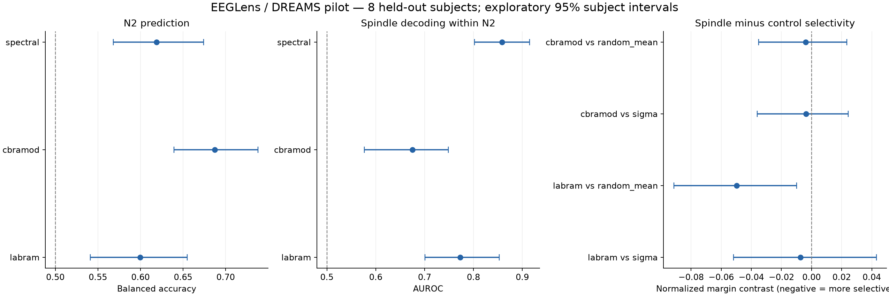

# EEGLens spindle experiment: results

**The pilot does not establish a shared spindle-specific mechanism.** Both models contain linearly decodable spindle-related information, but spectral/amplitude features are stronger. LaBraM shows some direction-specific N2-margin effects compared with random controls; its effect is not distinguishable from the sigma direction in this small sample. CBraMod does not show consistent spindle-specific intervention evidence. Neither model shows a reliable overall balanced-accuracy reduction from the spindle erasure.

All values below come from the corrected, text-verified microvolt pipeline. The initial reader-scale run was invalidated and is not included. Intervals are 95% subject-bootstrap descriptive intervals (8 subjects, 10,000 resamples), not corrected confirmatory significance tests.

## Prediction baseline

| Features | N2 balanced accuracy | N2 AUROC |
|---|---|---|
| majority | 0.500 [0.500, 0.500] | 0.500 [0.500, 0.500] |
| spectral | 0.619 [0.568, 0.674] | 0.727 [0.648, 0.812] |
| cbramod-random | 0.624 [0.594, 0.660] | 0.668 [0.626, 0.716] |
| cbramod | 0.687 [0.639, 0.738] | 0.776 [0.726, 0.830] |
| labram-random | 0.610 [0.573, 0.653] | 0.656 [0.610, 0.709] |
| labram | 0.600 [0.541, 0.655] | 0.687 [0.609, 0.763] |

Paired pretrained minus random-weight balanced accuracy:

- cbramod: 0.064 [0.030, 0.095]. The random encoder uses one initialization seed.
- labram: -0.010 [-0.057, 0.030]. The random encoder uses one initialization seed.

## Spindle information within N2

All concept fitting uses reviewed training N2 windows. Layer/C selection uses validation subjects. Metrics are averaged over held-out subjects, not pooled epochs.

| Probe | Held-out AUROC |
|---|---|
| spectral | 0.858 [0.802, 0.915] |
| cbramod | 0.675 [0.576, 0.749] |
| labram | 0.773 [0.701, 0.853] |
| cbramod_residual_concept_score | 0.477 [0.397, 0.561] |
| cbramod_adjusted_direction_score | 0.493 [0.396, 0.588] |
| cbramod_expert2 | 0.721 [0.645, 0.787] |
| labram_residual_concept_score | 0.546 [0.451, 0.656] |
| labram_adjusted_direction_score | 0.572 [0.485, 0.673] |
| labram_expert2 | 0.680 [0.627, 0.723] |

`residual_concept_score` is a probe on activations after train-fitted spectral/amplitude regression. `adjusted_direction_score` tests the resulting direction after removal of the fitted nuisance span. `expert2` uses independent second-rater labels on the six available subjects, with the original expert-1-trained probes and no reselection.

The residual results do not establish reliable spindle information beyond the selected spectral/amplitude controls. This does not prove its absence: linear residualization may remove genuine spindle signal, and there are few training subjects.

## Internal intervention

All directions are rank one. Each control matches the raw spindle erasure norm per window. LaBraM CLS is preserved. The unchanged native remainder and fixed staging readout produce the edited prediction. Identity replacement and cached-feature parity are asserted in each test batch.

Selectivity is the positive-minus-negative matched N2 margin change, normalized by the training margin standard deviation. More negative values indicate preferential suppression on spindle-positive windows. Control contrasts below subtract the control selectivity from spindle selectivity.

| Model | Spindle vs random mean | Spindle vs sigma | Spindle vs slow-wave control |
|---|---|---|---|
| cbramod | -0.004 [-0.035, 0.024] | -0.004 [-0.036, 0.024] | 0.010 [-0.012, 0.033] |
| labram | -0.050 [-0.092, -0.010] | -0.007 [-0.052, 0.043] | -0.068 [-0.119, -0.015] |

Raw accuracy-drop and perturbation evidence:

| Model/control | Balanced accuracy drop | Maximum relative norm mismatch |
|---|---|---|
| cbramod/spindle | -0.002 [-0.018, 0.016] | 0.00e+00 |
| cbramod/adjusted_spindle | 0.004 [-0.010, 0.023] | 4.96e-07 |
| cbramod/sigma | 0.003 [-0.007, 0.015] | 5.37e-07 |
| cbramod/slow_wave | 0.012 [0.003, 0.024] | 5.46e-07 |
| cbramod/shuffled | 0.010 [-0.007, 0.028] | 5.51e-07 |
| cbramod/random_mean | 0.008 [-0.003, 0.019] | mean of 10 controls |
| labram/spindle | -0.007 [-0.017, 0.002] | 0.00e+00 |
| labram/adjusted_spindle | 0.004 [-0.004, 0.012] | 4.23e-07 |
| labram/sigma | -0.005 [-0.021, 0.014] | 4.94e-07 |
| labram/slow_wave | 0.017 [-0.009, 0.043] | 4.78e-07 |
| labram/shuffled | 0.000 [-0.012, 0.012] | 9.40e-07 |
| labram/random_mean | -0.001 [-0.011, 0.010] | mean of 10 controls |

## Coverage and limitations

- 808 stable-stage 15-second windows from eight DREAMS patients; no full-night or clinical staging claim.
- Matched pairs by subject: [12, 8, 4, 5, 14, 13, 11, 9], total 76. Maximum absolute mean standardized covariate differences by subject: [0.33, 0.365, 0.453, 0.586, 0.821, 0.858, 0.681, 0.493]. Matching is imperfect and does not establish complete control of confounding.
- First-rater concept coverage ends conservatively at 990 seconds. Unreviewed or ambiguous windows are not negative spindle examples.
- The slow-wave morphology control is signal-defined. No matched human K-complex control was available; separate DREAMS subsets cannot be joined by excerpt number.
- Single central electrode, 0.5–20 Hz bandwidth, short independent windows and mean pooling constrain what this pilot can reveal about the full pretrained models.
- Subject bootstrap intervals are exploratory; overlapping fold training sets, eight subjects, multiple controls and one random-weight seed limit inference.
- Layer-wise linear probes and rank-one interventions do not exhaust possible nonlinear or distributed mechanisms. Model/readout dependence is not a biological causal claim.

## What this establishes

EEGLens can execute a complete, falsifiable experiment linking human annotations, held-out readouts, native internal interventions and matched perturbation controls. This experiment separates decodability from selective use: a spindle-related probe alone would have supported a stronger story than the controls justify. The next scientific question is whether richer event/time representations yield evidence beyond spectral statistics on a larger, independently annotated cohort; it is not answered here.

Reproduce with [README.md](README.md); fixed decisions and the unit correction are in [PROTOCOL.md](PROTOCOL.md). Machine-readable aggregate outcomes are in [results/summary.json](results/summary.json).

Sources: [DREAMS](https://zenodo.org/records/2650142), [physiological-feature audit](https://arxiv.org/abs/2605.11410), [EEG SAE interpretation](https://arxiv.org/abs/2605.13930).

